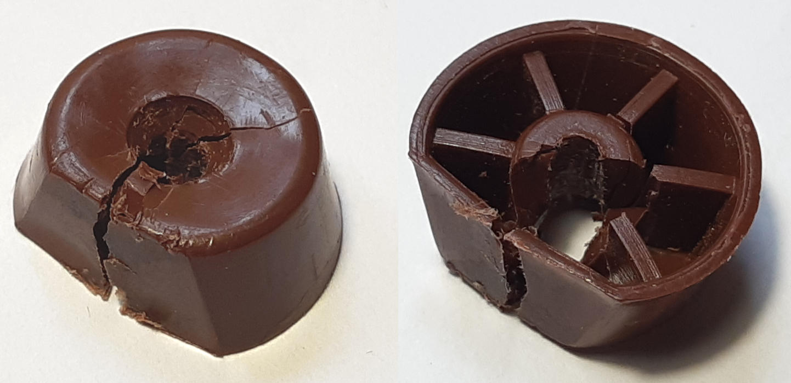
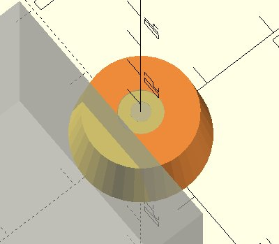
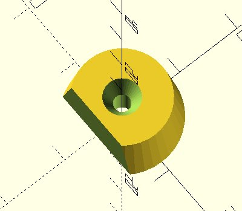
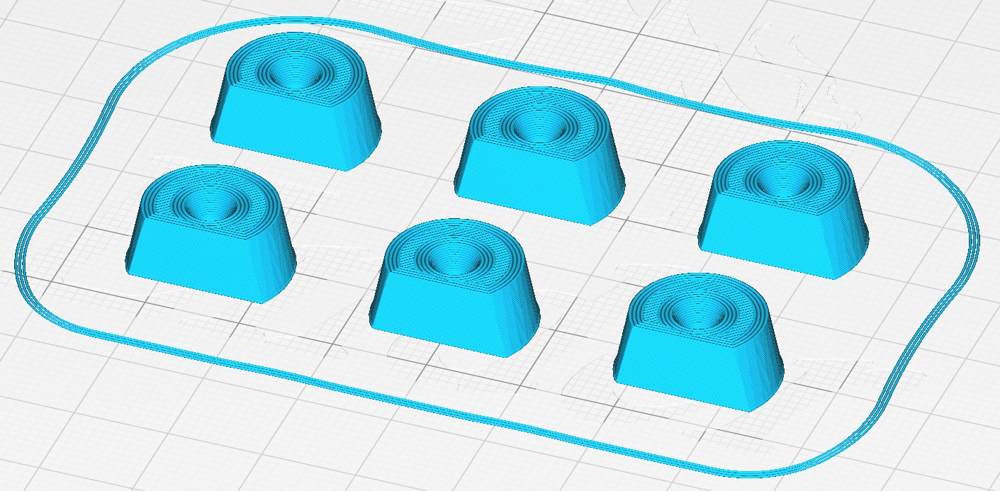
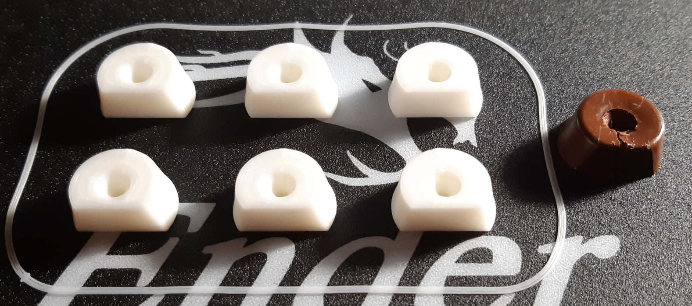
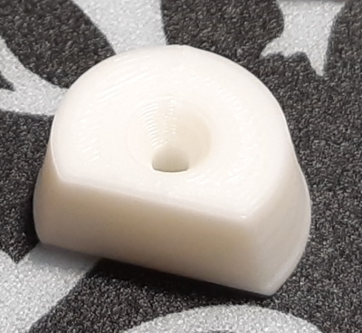

# Wardrobe door stopper

2020-JAN-02, _Samuel M.H._


## Introduction
This is an introductory article to the 3D printing world. I am covering all the process to solve a real problem.

## The problem
Over the time, the door stoppers of the wardrobes of my room have worn away.
We can clearly see the stopper is cracked due to compression forces, the hit of the door.



If we closely inspect the piece, we find it is made of plastic, it is hollow and it has been designed to be cheap, not to last long.

Lets build our own door stoppers that hopefuly will last much longer!

## The process

### Design it!
The program I have used to design the piece is [OpenScad](https://www.openscad.org). It is a parametric computer-aided design software, that means we have to write what we want so the mouse will not be mandatory. The program provides basic [polyhedra](https://en.wikipedia.org/wiki/Convex_polytope) building functions as well as operators to perform unions, diferences, transformations, etc. I recommend to see the [cheatsheet](https://www.openscad.org/cheatsheet/) to get an idea of the capabilities.

When measuring, I recommend to use a [caliper](https://en.wikipedia.org/wiki/Calipers#Vernier_caliper) but since precission is not very important in this piece, we could also use a school rule.

These are the steps I followed:
1. Build a truncated cone/ cylinder with different bases. The piece is like a cone with a cut and a hole. So we measure:
  * The big diameter of the piece (bottom).
  * The smaller diameter (top)
  * The height.

  As a cylinder is not a polyhedron, a truncated pyramid with 40 faces will do the job.

1. The hole for the bolt. Measure:
  * Smaller diameter for the bolt (bottom).
  * Height of the piece, and we make it longer to go all the way through.
  * Bigger diameter fot the bolt head (top).
  * Depth for the bolt head
1. The flat cut, the face that makes contact with the door. Measure:
  * The distance from the cut to the big base that passes through the center of the piece.

Conceptually this is the building schema.
1. A truncated cone (red+yellow).
1. The hole for the bolt, in the center of the piece (grey for the bolt, yellow for the head).
1. A cutting cube (grey).




The previous steps tranlates to this code.

```javascript
difference(){
    cylinder(h=7.5, d1=17, d2=14, $fn=40); //Base cone
    union(){  // Hole for the bolt
        translate([0,0,7.5-2.6+0.1]) cylinder(h=2.6, d1=2.5, d2=5.5, $fn=40);
        translate([0,0,-0.1]) cylinder(h=7.8,d=2.5, $fn=40);
    } //Flat cut to stop the door
    translate([0,-17-4.5,0]) cube(17*2, center=true);
}
```

And this is the resulting piece



We export the piece into a `.stl` file.

### Slice it!
The next step is to generate a [`.gcode`](https://en.wikipedia.org/wiki/G-code) file that will contain the instructions the actual 3d printer will follow to build the piece layer by layer.

I have used [cura](https://ultimaker.com/es/software/ultimaker-cura) to load the `.stl` file, duplicate the piece to make 6 of them and set the [infill](https://all3dp.com/2/infill-3d-printing-what-it-means-and-how-to-use-it/) to 80% so the piece is not completely solid but still tough.

This is a preview of the expected result.


So I export it as `.gcode` file.

### Extrude it!
1. Put the `.gcode` file into a SD card and plug it into the printer.
1. Calibrate the printer
1. Print the piece!

And this is the result in comparison with the original piece. Pretty accurate!


This is a detail of a single piece, it is possible to see the layers.



### Test it!
Now I am going to replace my broken door stoppers, I hope this ones last longer :) .

## Resources
* Door stopper design
  * [OpenScad file](piece.scad)
  * [STL file](piece.stl)
* Sofware
  * [OpenScad](https://www.openscad.org)
  * [OpenScad command cheatsheet](https://www.openscad.org/cheatsheet/)
  * [Cura](https://ultimaker.com/es/software/ultimaker-cura)
