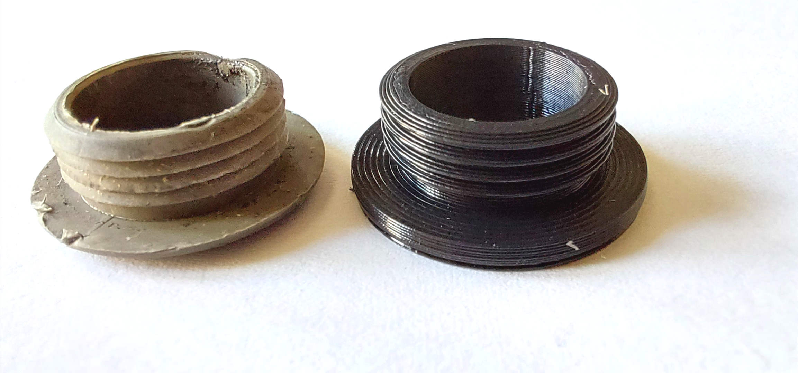

# A ring for the lock mechanism of a car door

2022-Sep-24, _Samuel M.H._

## Description
As cars get old, some decorative pieces made of plastic degrade due to the everyday UV radiation, heat and humidity; become brittle and eventually crack.

In my case, a decorative ring from the door lock mechanism broke. 

And the door looked bad.

## Design
This time I will build the piece as a [surface of revolution](https://en.wikipedia.org/wiki/Surface_of_revolution).

The first step is to take measures and draw the profile.

This is the result once the shape is extruded.

## Printing process
As my printing is [FDM](https://en.wikipedia.org/wiki/Fused_filament_fabrication)-based, I cannot have overhanging sections, so I have to make some concessions and adapt the original design.

1. Reverse the piece.
2. Get rid of the original saw-shaped profile and modify it to overcome to this restriction.

As we can see in the gcode output, the filament is always supported by the inferior layer.

Another improvement is to choose a big `Wall Thickness` parameter so the piece is solid (and hopefully last longer).

## Result
And this is the final result. The original piece is the grey one.

Bottom view.

Top view.

Side to side.

Installed in the car.

Compared to the original one.

## Resources
* [OpenScad file](car_door_lock_ring.scad)
* [STL file](car_door_lock_ring.stl)
