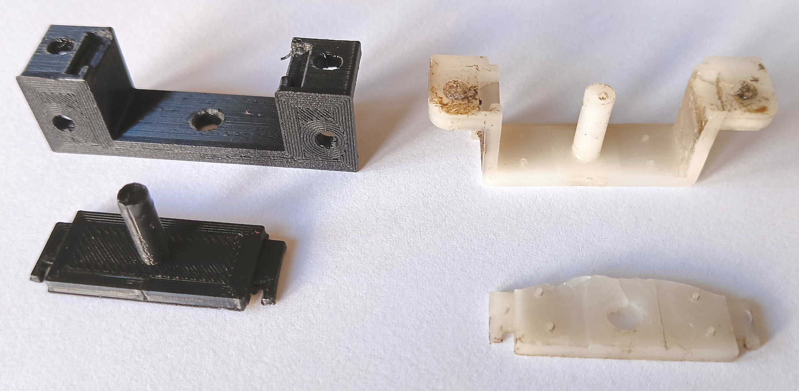
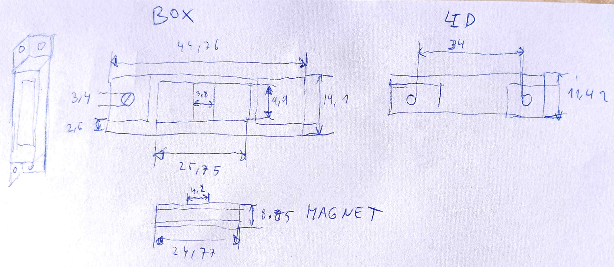
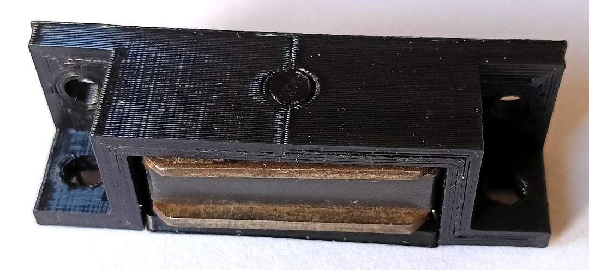
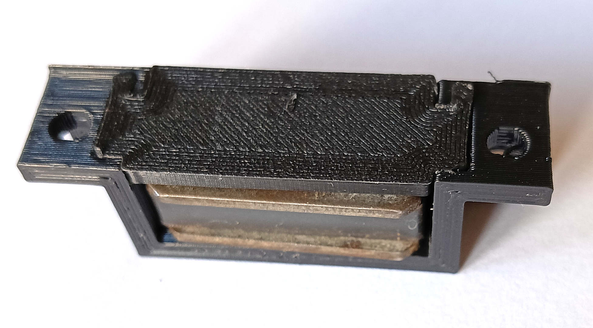
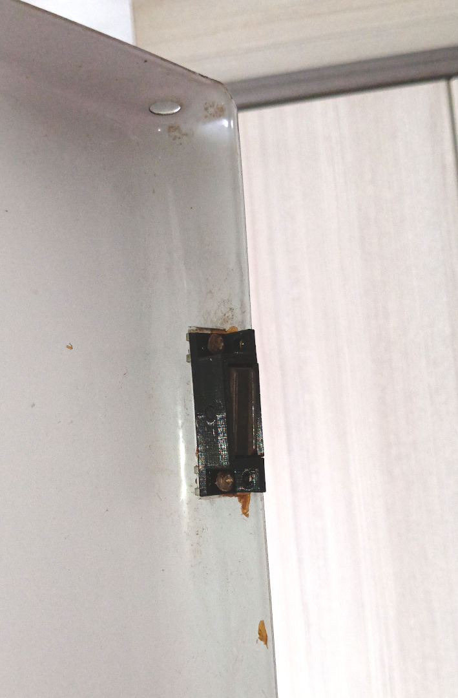

# A cupboard door magnet

2025-Feb, _Samuel M.H._

## Description
Lets build a door magnet for the front door of a water heater!

Here we are once again dealing with plastic parts that degrade with time. Unfortunately I couldn't find a spare part in the hardware store. Sure, there are replacements but not with the holes on the front of the piece (they are usually on the side).

On the left the final result, on the right the original piece (with broken holes).

## Design
The piece is made of two parts, the case and a lid. They should fit together nicely, but if needed, a drop of glue will hold everything in place.

A simple sketch.

## Printing process

Printing the piece is straightforward and there are no tricks. Even the .stl file sets the pieces so there is no need for supports.

## Result

Top view.

Bottom view.

In place

## Resources
* [OpenScad file](cupboard_door_magnet.scad)
* [STL file](cupboard_door_magnet.stl)
