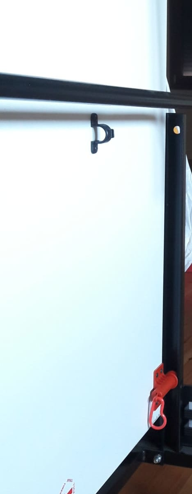
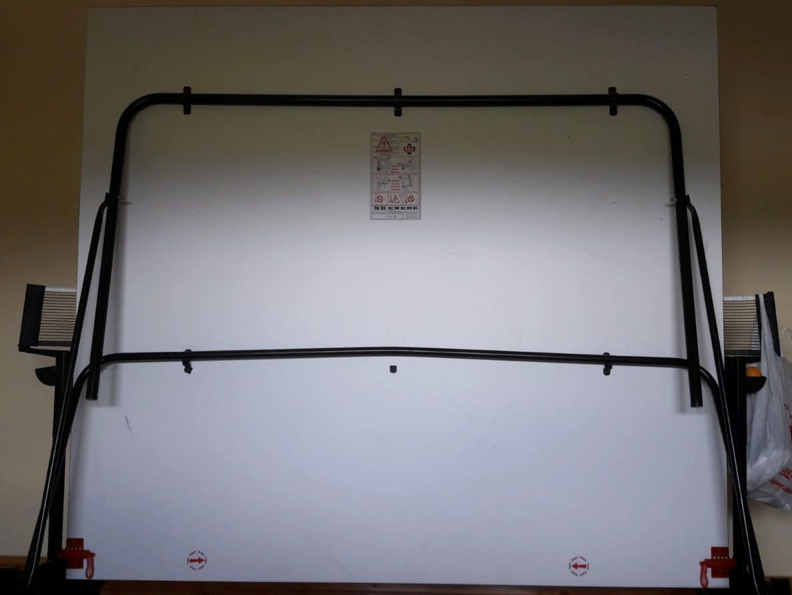
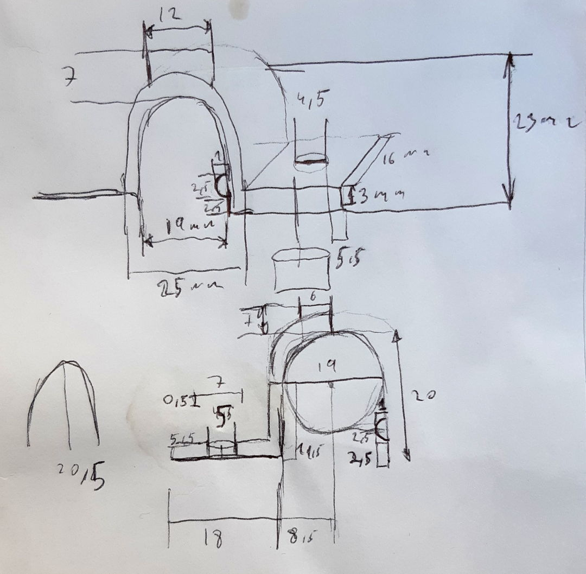
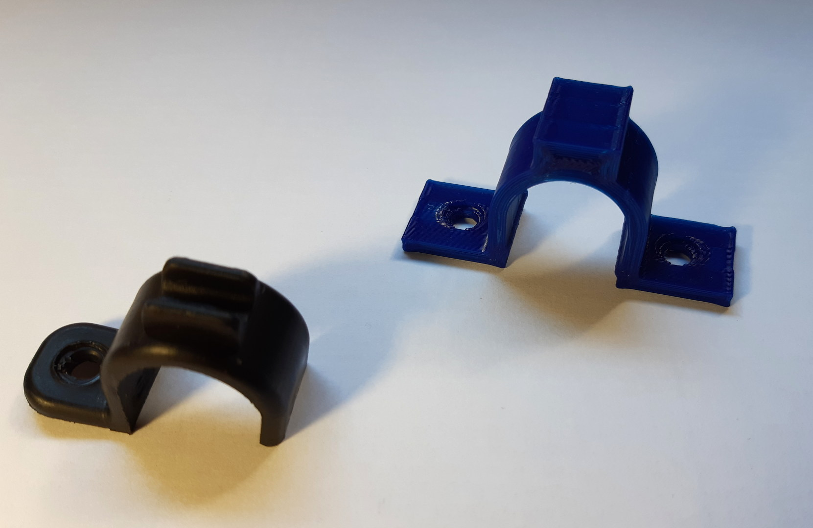

#  A hinge for the bar of a Ping Pong table.

2020-MAY-24, _Samuel M.H._

## Description
Lets say I share the world with other people that don't take as much care as I do with my possesions. In this case, someone broke my old table tennis. I suppose it is the result of some unfortunate envents, you know: someone improperly folded the table, then other person tried to open it and didn't notice a bar was reversed, and of course didn't care when they heard a crack.

Two more cracks, this person also didn't care and ended up with three broken hinges, a folded bar and of course, playing no-table tennis.

Then I receive a phone call to tell me bullshit. I seriously think some people think I am a real world [fix it Felix](https://en.wikipedia.org/wiki/Felix_(name)).

["Shō ga nai"](https://en.wikipedia.org/wiki/Shikata_ga_nai), ["C'est la vie"](https://en.wikipedia.org/wiki/Glossary_of_French_expressions_in_English#C.27est_la_vie), or my favourite "[Te jodes como Herodes](https://es.wiktionary.org/wiki/te_jodes_como_Herodes)". I choose to do something about it.

## The process
My usual aproach is pretty straightfoward yet effective.

1. Take measurements draw the best blueprint.

2. Design the piece with my beloved OpenScad.
3. 3D Print the piece

This is the comparison of the broken hinge (black) with the new one (blue).

And that's all Folks!

## Resources
* [OpenScad file](hinge_table_tennis_bar.scad)
* [STL file](hinge_table_tennis_bar.stl)
