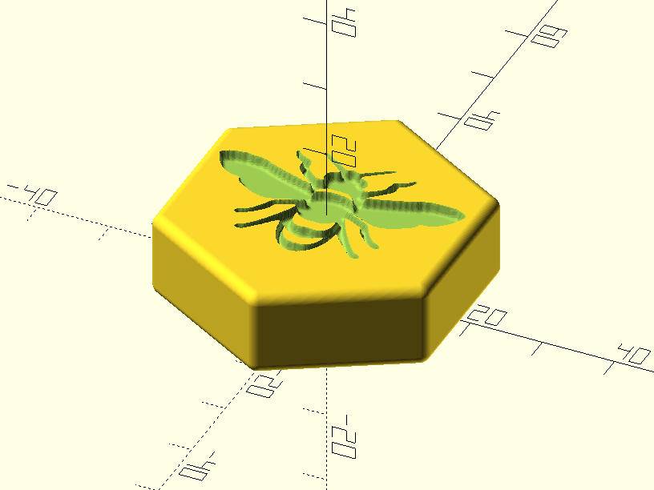

# Custom pieces for Hive (the game)

2021-Jun-13, _Samuel M.H._

## Description
[Hive](https://en.wikipedia.org/wiki/Hive_(game)) is a bug-themed tabletop abstract strategy game, designed by John Yianni and published in 2001 by Gen42 Games. It is made of hexagonal pieces with its own movements depending on their type, represented by the image of a bug on the top of the piece.

This project enables the user to create their own custom-themed set of pieces (hive-compatible) to play this fabulous game. It started as a birthday present, so you get the idea.

## Disclaimer
I have no intention to violate any intellectual property or to get any profit at all. In fact, it is cheaper (in time, tools, headaches...) to buy the original game than to 3D print and paint it. Nevertheless, there are several reasons to build your own set:

* You don't have access to buy the original game.
* You have lost a piece and need a spare.
* You  want a custom version of the game: size, theme, etc.


## Themes
These are the themes I've already created. Feel free to contribute.

* [epsmith](themes/epsmith), a bug-based theme.
* [dragon_ball-good](themes/dragon_ball-good), a Dragon Ball theme with the good guys.
* [dragon_ball-bad](themes/dragon_ball-bad), a Dragon Ball theme with the villains.


## Design overview
I will use OpenScad as the 3D design tool and the Gimp to process the images.

### Basic piece
The first action is to design the piece. I will take the original and pocket sizes to make it compatible with comercial versions.


Of course the size can be arbitrarily modified.

This is the shape of an unbranded piece.


### Branding a piece
It is time to put an image on the top. In order to automate the process, I have created the `build_piece` bash script. This way, a single OpenScad design (`piece.scad`) can be parametrized to render a custom design from an image file.



And this is all the technical part, but just a small part of the project.


## How To

### Design your own theme

_NOTE: You can achieve all this steps with an internet browser and an image editing software like [GIMP](https://www.gimp.org/downloads/)._

The first thing is to generate your icons (images). 

#### 1. Choose good and suitable icons
Remember it is a theme! This step altough obvious is very important as it will determine the final outcome. Please, spend some time.

1. Assign an icon or some mental representation to each bug.
1. The icons in the theme should have consistency between them.
1. Scout, research and gather as many candidate images for each piece to have a decision.
1. Keep the designs simple, the resolution of a 3D printed piece is not the same as the sceen or a paper.
1. Be open-minded and change your initial idea as needed.
1. It is hard to obtain pure icons, so most of the times you will have either to cut the desired icon or resign to other option. It is a matter of how much time you want to spend.

#### 2. Convert icons to the desired format
The generated pieces are a bas-relief. The icons are "carved" on the piece and we need a format to do that.

1. The way to get this effect is by **converting the icons to black and white** or grayscale.
1. A white pixel represents no carving and a black one means the deepest carving. A gray color means something between in depth. 
1. In my experience, the best results are obtained with pure black and white images, no grayscales.
  1. This is possible by posterizing the image to 2 colors. This technique has the advantage of creating solid walls when printing, and solid walls is something you want when you paint the pieces with ink so it won't flow outside the boundaries.
1. Sometimes it is better to lower the resolution of the original image to get a better idea of the result in 3D.
1. The image must have a 1:1 aspect ratio, a square.
1. The effective icon will be the hexagon inscribed in the square. This is a very-opinionated decision, but resulted to be the less worse and easiest one.
  1. In GIMP, in order to have an aproximate idea, use the elipsoidal selection tool instead of the square one.
     
  1. This is the final result. Note the artifacts in the ears and cut antenas.
     
1. Export the image to PNG `hive/themes/<theme>/img/<bug_name>.png`. For example `hive/themes/dragon_ball-good/img/grasshopper.png`. Yes, Picolo is the grasshopper because it is green.
1. If you want the piece to have a vertex on top instead of and edge, name it with an ending `_1`. For example `hive/themes/epsmith/img/queen_bee_1.png`. Didn't you notice it was rotated? Check it again!
  


### Build the models
Now that you have your awesome theme with the icons in the desired format, it is time to build the actual 3D models.

The `hive/build_theme` script will take the icons of a theme from `hive/themes/<theme>/img/*.png` and generate the STL 3D models in `hive/themes/<theme>/stl/*.stl`.  If the `stl` directory exists, it won't run in order to protect the pre-existing work, so be sure there is no `stl` folder.

The invocation is straightforward.
```bash
build_theme <theme>
```

### Slice the models
It is time to convert the models, a.k.a. slice, to a representation suitable for your 3D printer. I use [Ultimaker Cura](https://ultimaker.com/es/software/ultimaker-cura) as it is free and works without headaches.

This is a good point to review your piece and see if your icon designs are too complex (or detailed) to be accurately printed.


### Print the actual pieces
Go to your 3D printer with the GCODE and wait your pieces to be printed!


### Paint Job!
The last step is to have some color on your pieces. This step is a bit complex-tedious if you have never done anything similar.

Tools and materials:
1. Buy the cheapest nail polish on the desired color palette. Nail polish is an oil-based lacquer used mainly by women to paint their nails. This means it is water resistant and highly available in a wide chromatic range. I unintentionally bought some glow-in-the-dark colors. Cool!
1. Buy some acetone. It is the liquid used to clean nail polish, try to get the purest one. We will use it as a solvant to make the nail polish more watery (less viscous).
1. Buy some insulin syringes with needles. Ideally one per color and one or two spares (in my case, the paint ended up eating some parts of the piston).
  
1. Buy some satinated transparent varnish for the final touch.


The idea is:
1. Add some nail polish to the syringe.
2. Add 2-3 drops of solvant (acetone) and make it flow though the needle
3. Paint the piece, cover the bas-relief as it was filled with liquid.
  
4. Allow it to get dry.
5. Give it like 3-4 hands of varnish to protect the piece.

And that's all folks!

_NOTE 1: the real final step is to have some custom hand-made bag in consonance with your theme._


_NOTE 2: when painting, it is better to paint several set of pieces at once (prepare a large batch). You will be more efficient, the nail polish won't get dry and you will get the maximum service out of the syringes (it is not alway possible to reuse them)._


## Resources

* OpenScad piece [stl](piece.scad)
* Script to generate a piece [bash script](build_piece)
* Script to generate a theme [bash script](build_theme)
