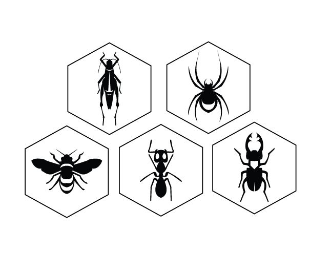
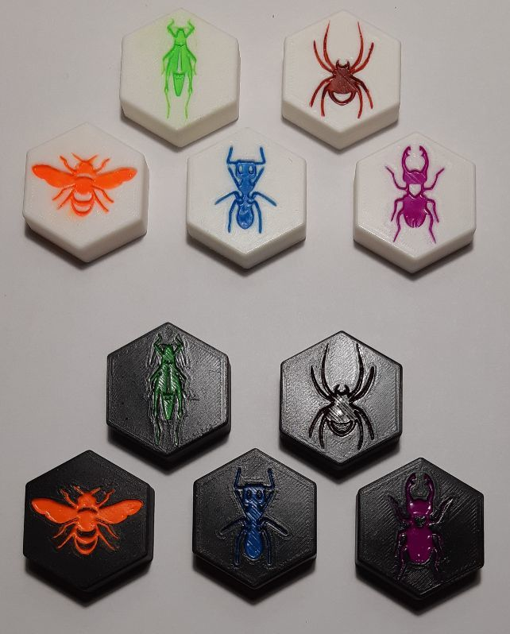
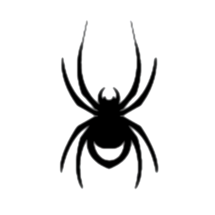
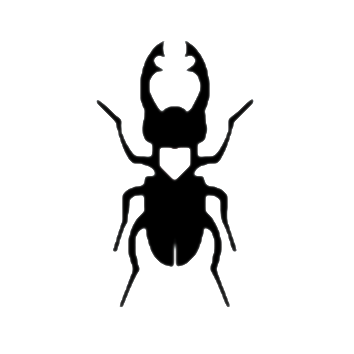
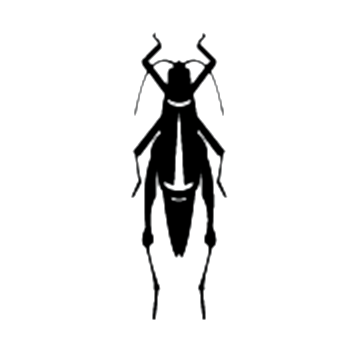
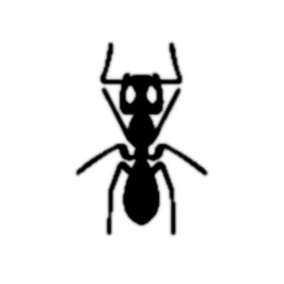

# Theme - epsmith

This is a bug theme based on the work of [epsmith](https://www.instructables.com/Custom-wood-and-metal-Hive-set-boardgame/), who designed a beautiful set of pieces on wood.

The original design.

The result.

## Pieces
These are the extracted an processed images to generate the models.

### Queen

### Spider

### Beetle

### Grasshopper

### Ant

## STL models

* [Queen](stl/queen_bee_1.stl)
* [Spider](stl/spider_1.stl)
* [Beetle](stl/beetle_1.stl)
* [Grasshopper](stl/grasshopper_1.stl)
* [Ant](stl/ant_1.stl)
