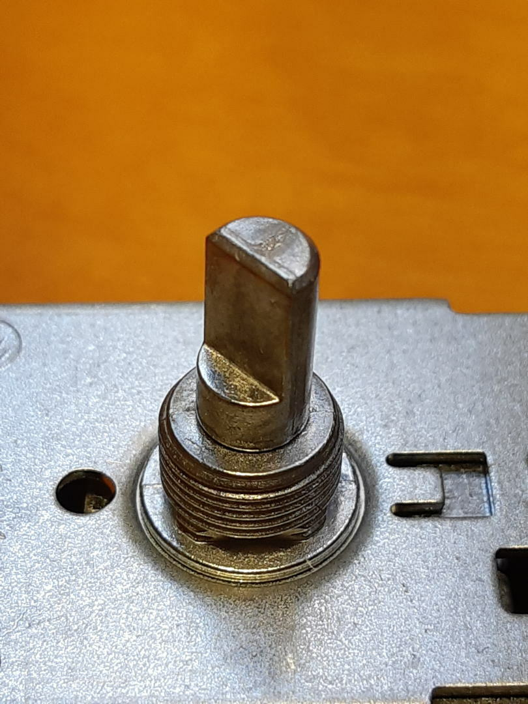
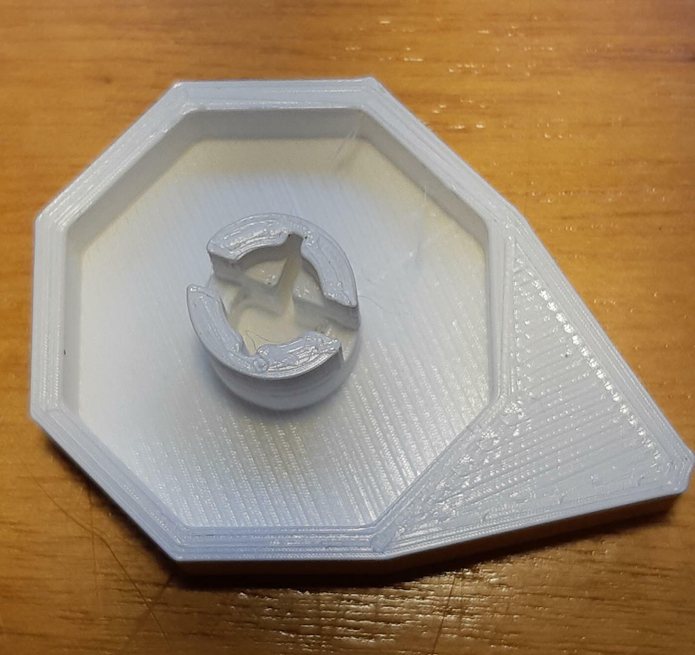
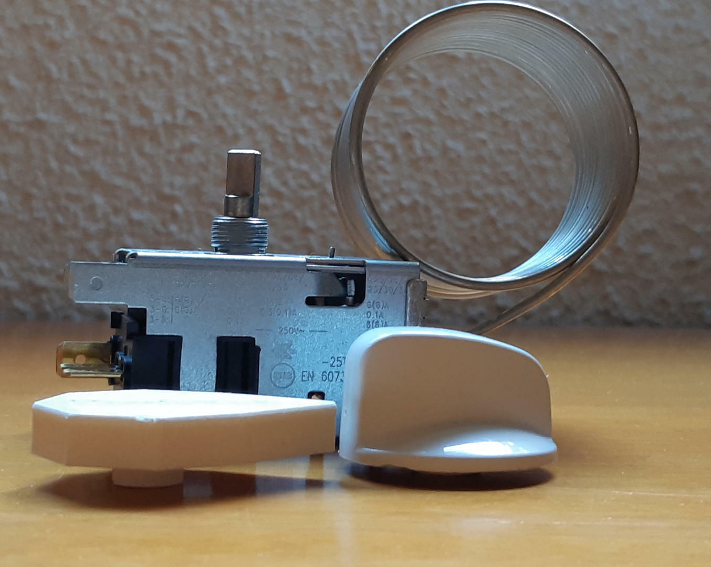

#  A short knob.

## Description
I was requested to build a knob for a thermostat, the original piece added much height and the machine could not fit the space.

## The process

The main challenge is to model the hole to fit the pivot.

An enlargement to the 8-sided shape was added to be the position indicator. There is also the brand name on the other side.

This is the final result.

This is a comparison between the original knob and the short one.

The piece without knob is 48mm height, with the original one 57mm and with the short one 51mm. So the short knob only adds 3mm.

## Resources
* [OpenScad file](knob_short.scad)
* [STL file](knob_short.stl)
