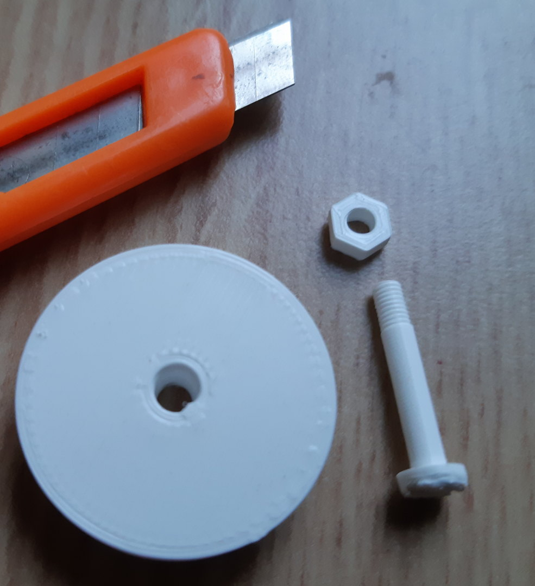

#  Nut and bolt for Ender 3 3D-printer filament guide.

## Description
This is a nut and a bolt for the [filament guide](https://www.thingiverse.com/thing:3061551) I use on my Ender 3 3D printer.

As I didn't have the requiered extra metalic pieces, I managed to design and print my own. Now you won't have to go to the hardware store.

## Notes
1. It is incredible the accuracy of this FDM machine.
1. I have used [this library](https://github.com/samuelmh/3dprint-lib_pocs) to design the threading.
1. Here is an image with the result

## Printing parameters

* Cura profile: Super Quality 0.12mm
* Layer height: 0.12mm
* Line width: 0.4mm
* Material: PLA
* Infill density: 40%
* Printing temperature: 200ºC
* Build plate temperature: 60ºC
* Print speed: 30 mm/s
* Wall speed: 15mm/s
* Cooling: yes
* Support: no

## Resources
* [OpenScad file](nut_bolt_filament_guide.scad)
* [STL file](nut_bolt_filament_guide.stl)
