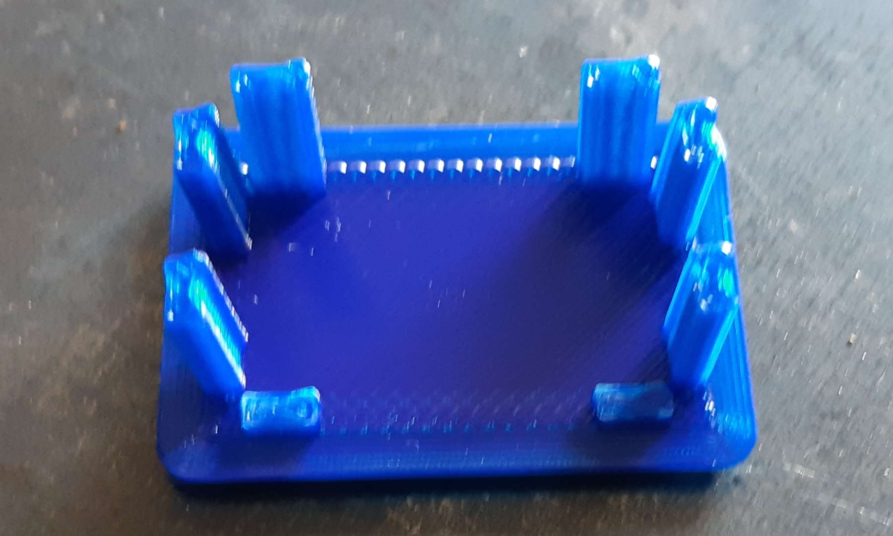

# A cap for a square-section tube

2020-OCT-03, _Samuel M.H._

## Description
Few years ago I built a metal table with rectangular tubes. Though I was satisfied with the result and I've used it as my primary workbench, I felt it was a little bit rough. So, I 've managed to design some caps to top off my first real soldering project with some bling and my mark.

## The process
As usual, the first step is to draw a wonderful design with all the specs.

Then I built it with my FDM printer. Things to notice:
* The mark SMH on the top.
* The pins that will fix the cap. 

Easy to design, easy to build, but will be enough?

And this is the tube where it will go.

Woops, I notice the pins are a little bit wide and they don't bend. So I have to remove 2 of them per cap. 

This is the result, the piece holds and the result is OK.

## Conclusion
Although the result is OK, I am not fully satisfied with it. These are my final thoughts:
1. I printed all the pieces without having a prototype, so the fit is not perfect.
1. I expected the PLA to bend a little bit, but it is very stiff and brittle. The pins cracks with almost no effort.
1. The design is parametric and I could adjust it to get a better fit with no effort.
1. The pins are so weak because of the building process. The force to bend a piece must go along the layer (2 dimensions to choose), not across it (perpendicular dimension) as the layers will split. I cannot solve it due to the nature of FDM, but I could change the pins and transform them into squares (with a better fit).
1. Pretty nice result having in mind there have not been previous tests.

## Resources
* [OpenScad file](tube_cap.scad)
* [STL file](tube_cap.stl)
