# Buttons for the flush mechanism of a toilet tank

2021-FEB-15, _Samuel M.H._

## Description
This time, both of the buttons of a WC tank broke. It is not like they support a heavy use, they are just buttons. What is the applied force every time they are used, like 1kg? Yet they broke. Why? Lets see.

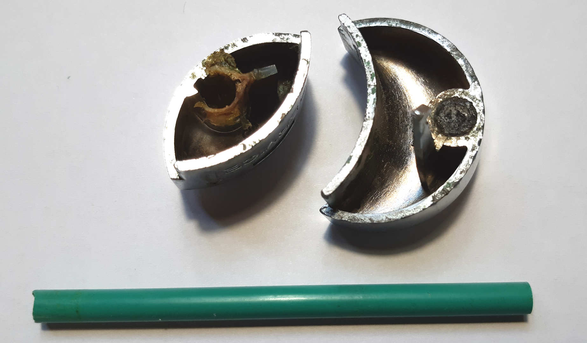

OK, they have been repaired several times. It is easy to see the plastic is crap and 2mm thick, the green rod is a spare part I had because the original one broke years ago. Lately, they had not been working fine, got stuck and were hard to use. It felt like you had to press very hard to make them work. I aknowledge the design is beautiful, but the utility is slim.

So, without buttons, I could go to the shop and pay too much to have the same problem, or design new ones tailored to my over-engineered needs. There is no doubt!

The first thing is to observe and think of a potential solution.

This is a view of the lid where the new buttons will have to fit.
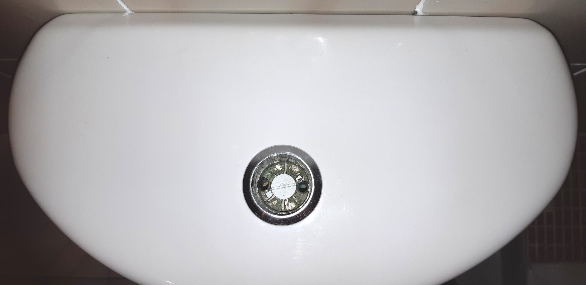

## Process
As always, my methodology is no-brainer.

1. Take measurements and draw the best blueprint.
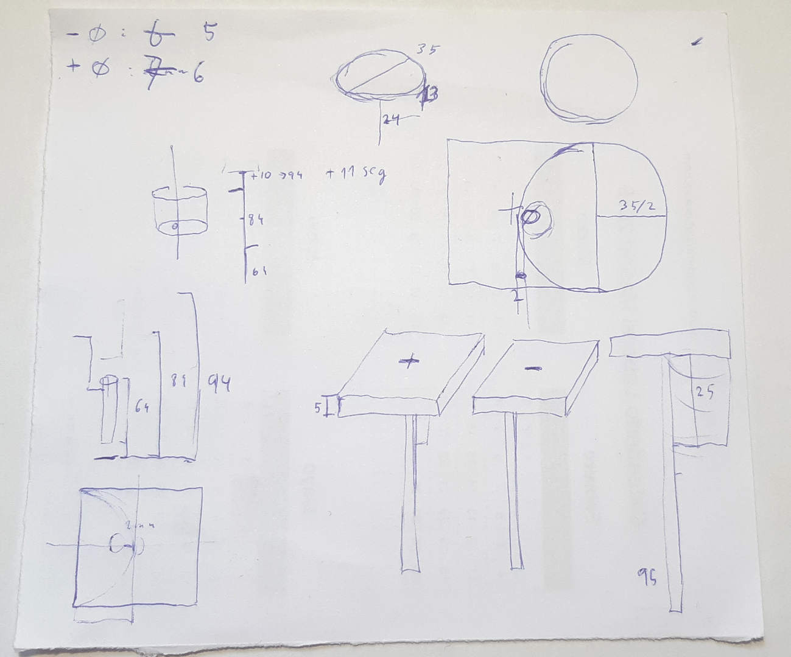
2. Design the piece with my beloved OpenScad.
3. 3D Print the piece.
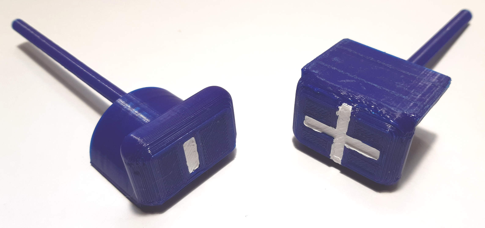

And just to add a little bit of sophistication, some white paint to mark the button for small water and the button for bigger issues. I don't want to be tagged as a brutalist designer.

## Design issues
Like in every matter, the devil is in the details. These have been my designing guidelines.

## Big buttons
I wanted the mechanism to be easy to operate. I don't want to jump on the button to flush.
So the buttons have to be big enough to be pushed without doubt.
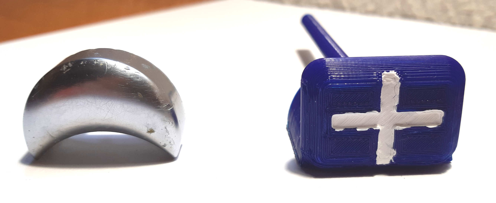

## Centered rod
When a button is pressed, the force is usually applied on the center of the surface. The rod in the old buttons was not aligned in the center of the pressing surface (see image in description) thus making an unconvenient leverage that made pushing the button so hard.

Of course I solved this by making the button bigger. Now the rod is set on the center of the button.

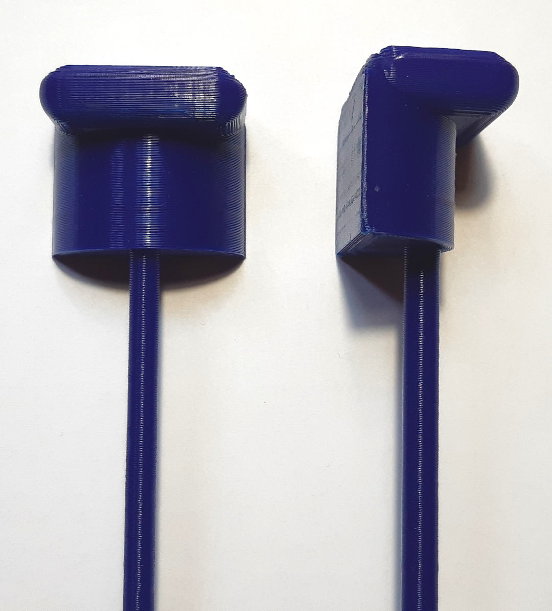

## Made to last
The original misaligned rod also caused unnecessary stress on the piece, affecting the durability. To make the piece as resistant as possible, some improvements have been made:

1. Centered rod as previously stated.
1. Semi-circular reinforcement between the button and the rod. This fits in the lid hole and guides the piece in a vertical motion thus limiting horizontal motion.
1. Solid rod from the botton to the top of the piece. In the slicer, it is possible to set the infill of a section (i.e. the rod).

The rod is solid.

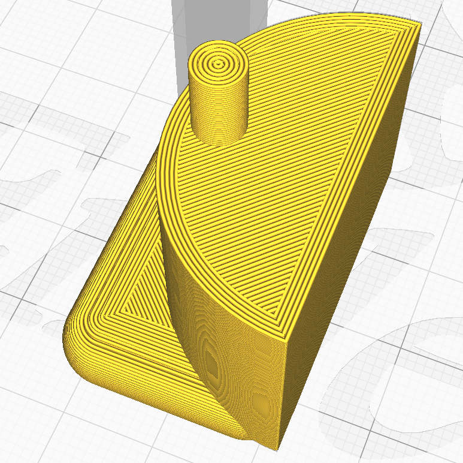

The rod section is solid in the semi-circular reinforcement.

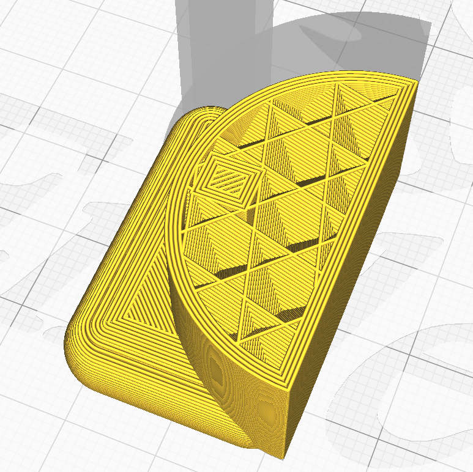

The rod section reaches the top of the button and aims for the center.

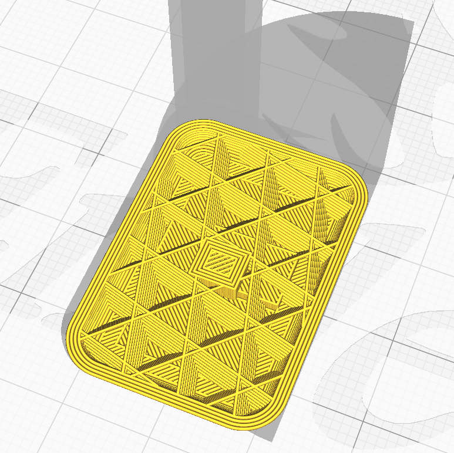

## Result
This is the final piece with the improved design.

The reinforcement fits the hole.
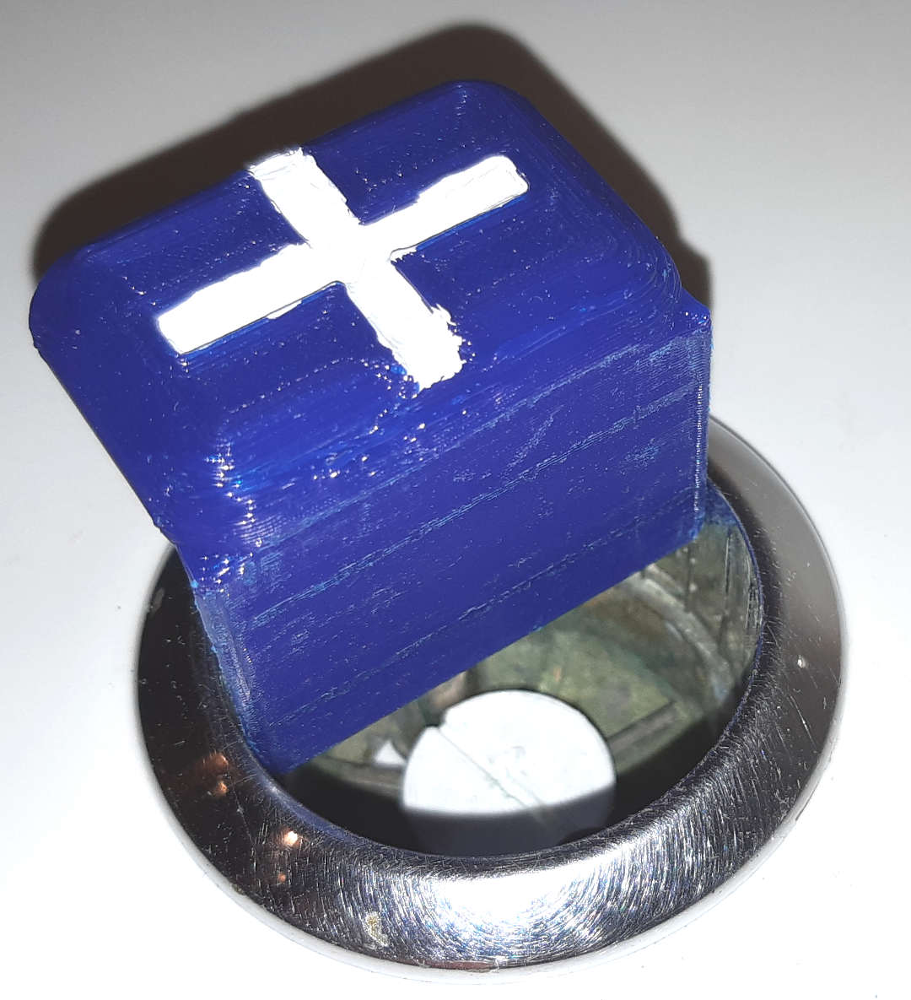

The rod is aligned with the center of the button.
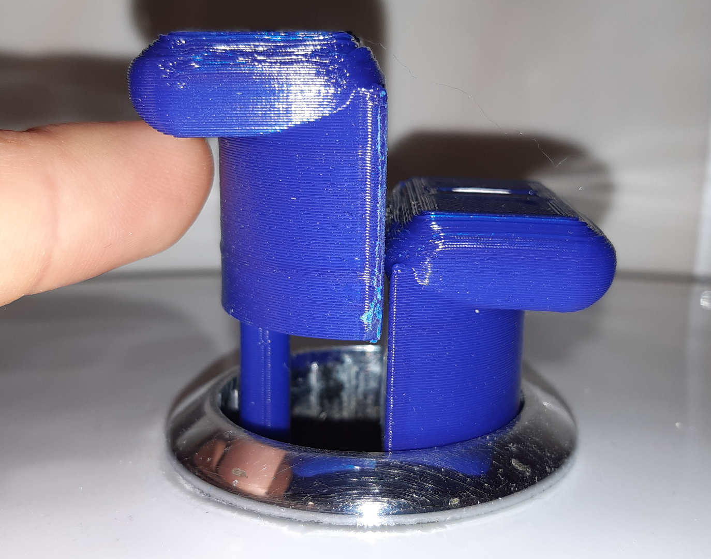

Front view.
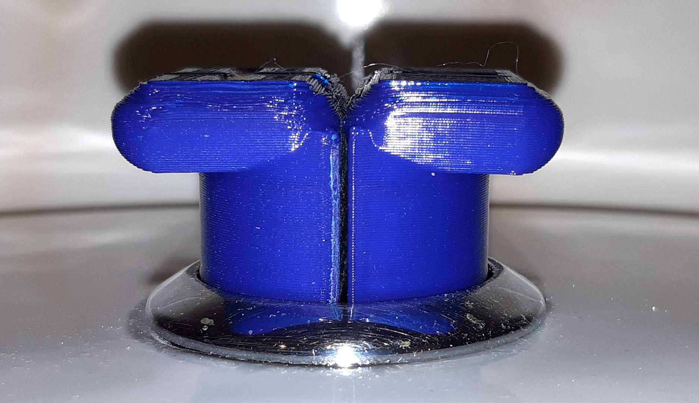

Front-upper view. Note the gap between the buttons. This is very important to ensure a smooth movement as horizontal layers tend to grip.
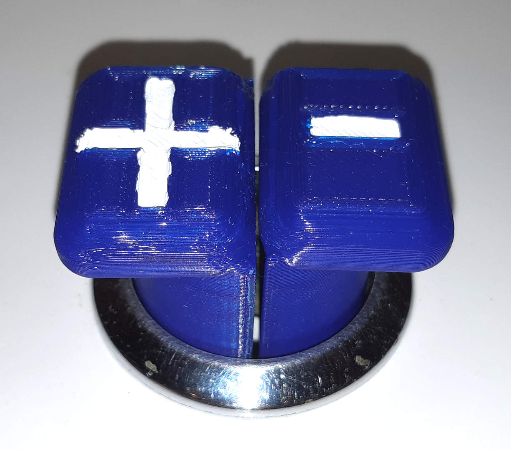

And that's all. Now I can flush with joy and feel proud :)

## Resources
* Button +
  * [OpenScad file](wc_button+.scad)
  * [STL file](wc_button+.stl)
* BUTTON -
  * [OpenScad file](wc_button-.scad)
  * [STL file](wc_button-.stl)

