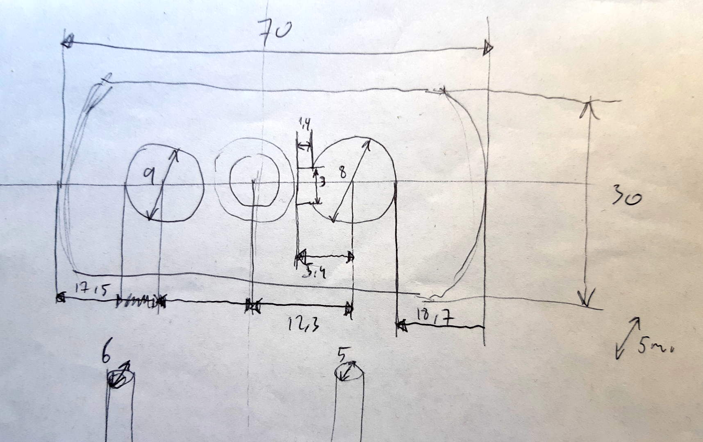
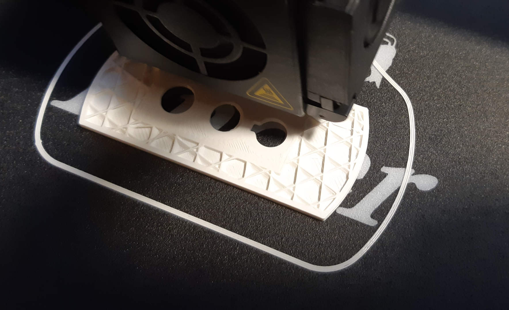
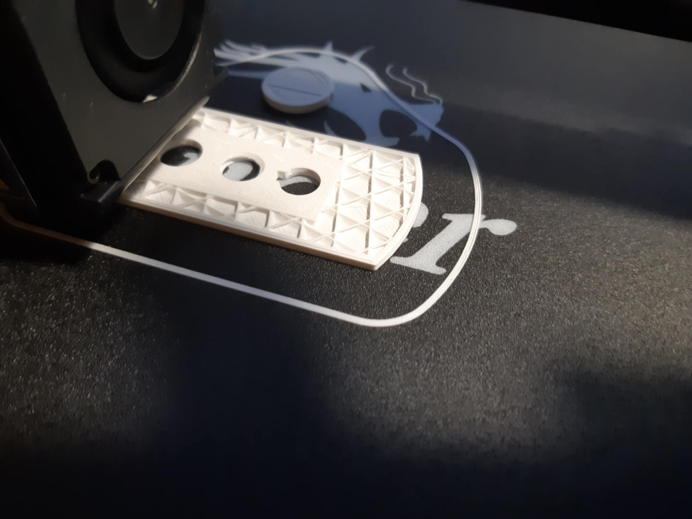
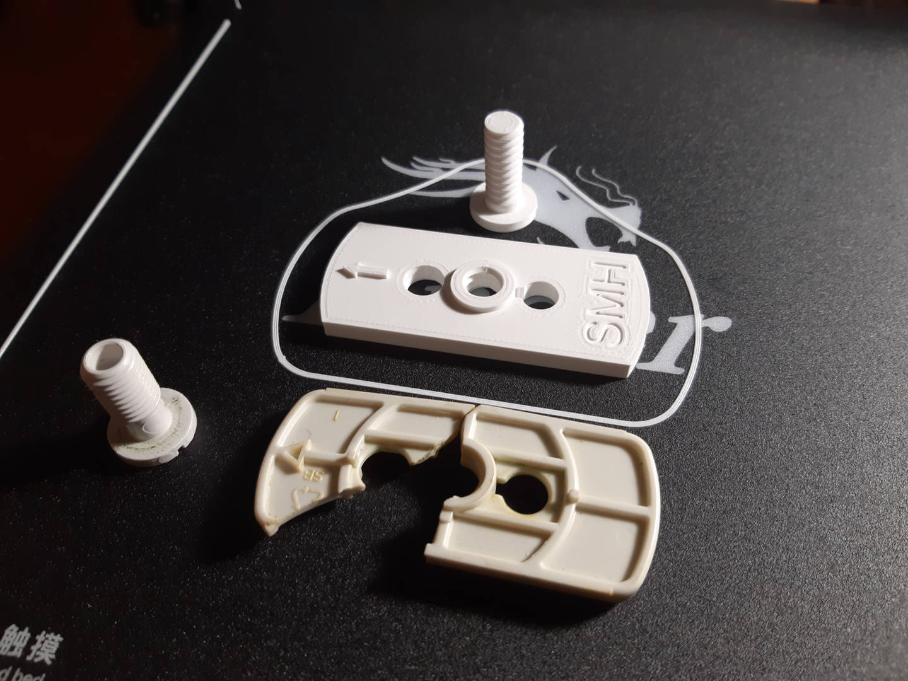
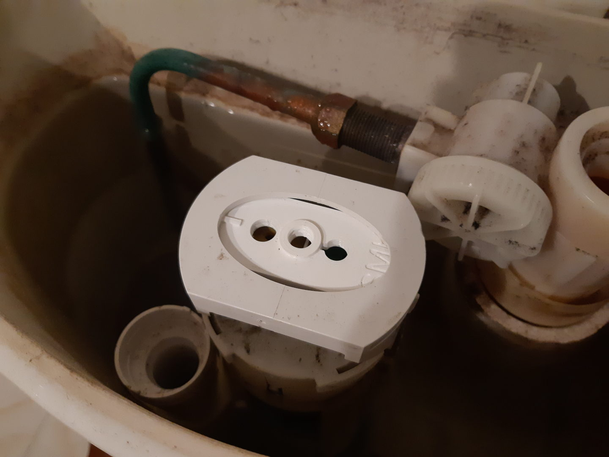

# Piece for a toilet flush tank

2020-JAN-07, _Samuel M.H._

## Introduction
Once again another plastic piece cracked. This time the piece was a holder for the mechanism of the toilet tank. I went to the dealer and told me I had to buy the hole discharge mechanism. No, thanks, it is just a piece of plastic.

The peculiarity is the piece is like a nut, the middle hole is threaded. The purpose is to join the discharge button holder with the flushing mechanism through a bolt. The other two holes guide some rods to connect the discharge buttons with the flushing internals.

I need something to create nuts, bolts, and so on. Like a virtual lathe. So I created a module that works pretty well to make bolts. It is available as a part of an OpenScad library [here](https://github.com/samuelmh/3dprint-lib_pocs).

## Process

### Design
The first step is to take measures. Because I get rid of the old bolt, I can design a new one as long as it basic shape is kept (I don't care spacing between threads and this things).

Here is my sketch.

### Build
Now is time for my beloved Cura to slice the piece. As I wasn't sure about the endurance of the design, I followed this [youtube tutorial](https://www.youtube.com/watch?v=su_m5zV9rvA) to make solid the center of the piece, the 3 holes. The old piece cracked following a line through 2 of the holes.

Here we can see the piece is solid in the center.

### Final piece
This is a comparison between the new piece with its own bolt, with my initials (SMH) and the old one.

Note how the old piece is broken an my concern to make some parts solid.

### Installation
The final step is installing it, maybe the arrow is a little bit big, but because the plastic is flexible it helps to keep the piece in place.

My toilet flushes again!

## Resources
* [OpenScad file](wc_flush.scad)
* [STL file](wc_flush.stl)
* [Cura project file](wc_flush.3mf)
* [Name vectorized in SVG](smh.svg)
* [Name in DXF format](smh.dxf)
